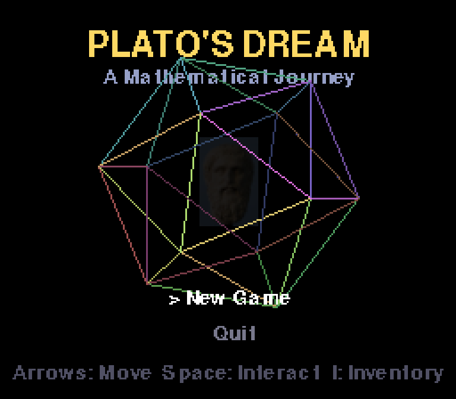
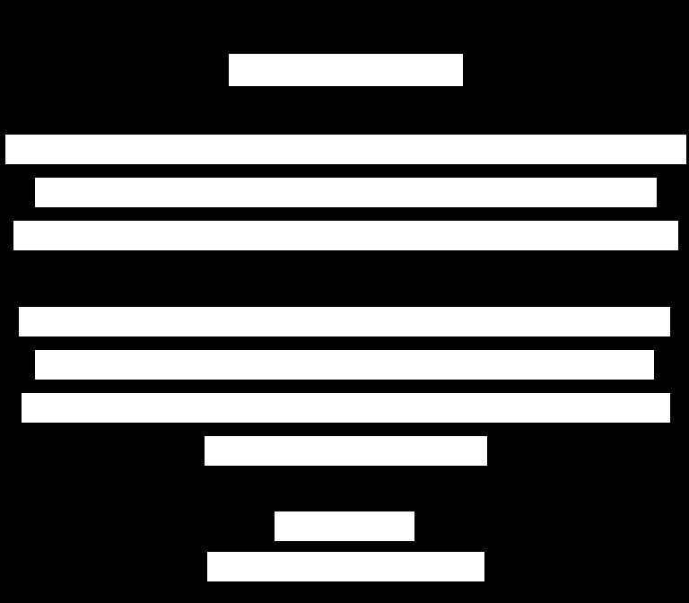
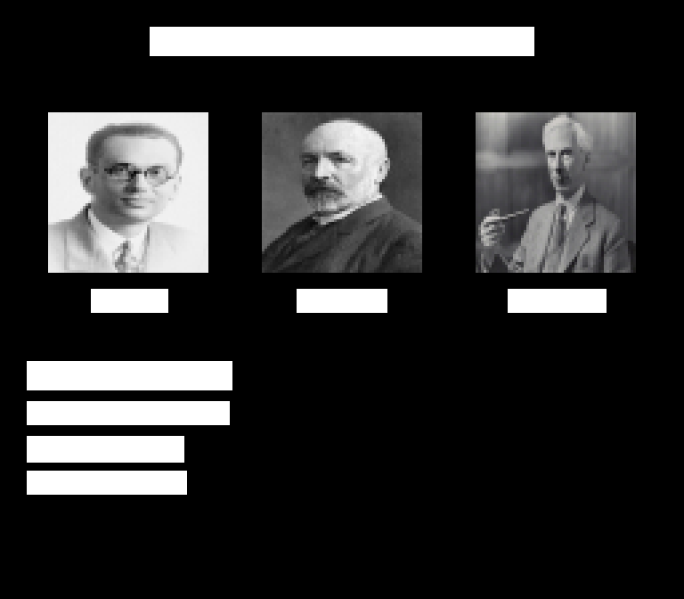
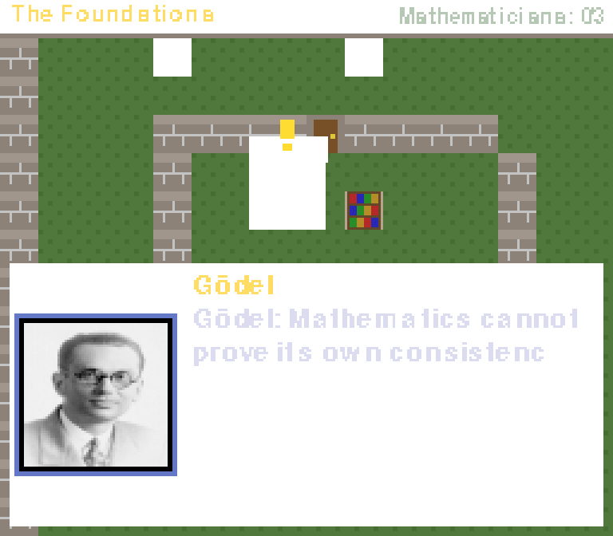
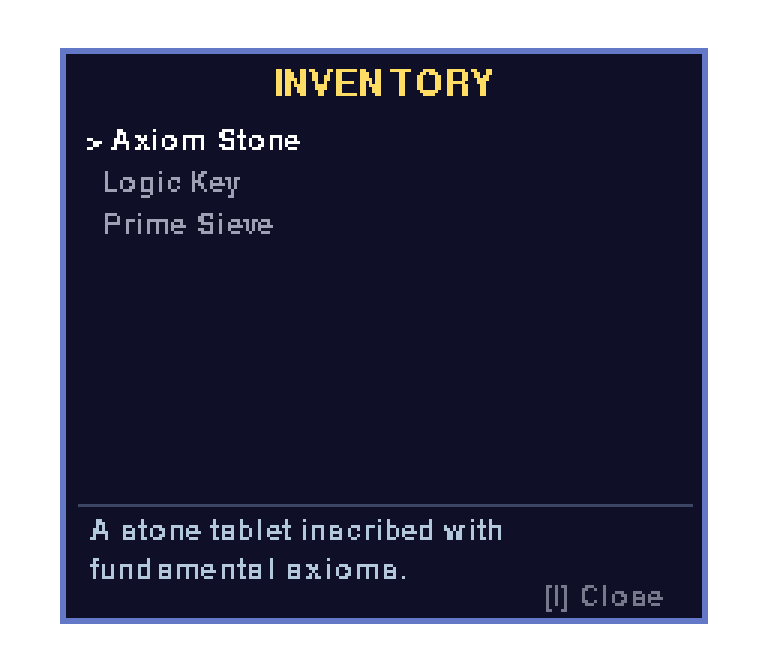

# Plato's Dream

**A Mathematical Journey**

An educational 2D exploration game that takes you through the history of mathematics, from ancient geometry to modern computation. Meet 24 legendary mathematicians across 8 beautifully crafted levels, collect artifacts of mathematical wisdom, and discover the interconnected dream of mathematical truth.

## Play Online

**[Play Plato's Dream in your browser](https://konradburnik.github.io/platos-dream/)**

No download required - runs directly in modern web browsers via WebAssembly.

## Screenshots

### Main Menu

*A rotating icosahedron welcomes you to Plato's realm of perfect forms*

### Story Introduction

*The journey begins with the philosophical foundations of mathematical truth*

### Level Introduction

*Each level introduces the mathematicians you'll meet and items to discover*

### Gameplay

*Explore tile-based worlds, interact with NPCs, and collect mathematical artifacts*

### Dialogue System

*Engage in deep conversations about mathematical concepts with legendary thinkers*

### Inventory

*Collect artifacts that unlock deeper discussions and new areas*

## The Levels

### Level 1: The Foundations (1870-1940)
*Late 19th - Early 20th Century*

Meet the architects of mathematical logic:
- **Gödel** - Incompleteness theorems
- **Cantor** - Set theory and infinity
- **Russell** - Logical paradoxes

Artifacts: Axiom Stone, Logic Key, Set Scroll

---

### Level 2: Realm of Numbers (1700-1920)
*18th - 20th Century*

Explore the mysteries of number theory:
- **Euler** - The identity e^(iπ) + 1 = 0, Riemann Hypothesis
- **Ramanujan** - Partition functions and infinite series
- **Gauss** - Prime distribution, Goldbach conjecture

Artifacts: Prime Sieve, Euler's Formula, Number Scroll

---

### Level 3: Palace of Algebra (1800-1880)
*19th Century*

Discover the abstract structures beneath equations:
- **Galois** - Group theory and solvability
- **Noether** - Abstract algebra and symmetry
- **Abel** - Impossibility of the quintic

Artifacts: Group Ring, Symmetry Crystal, Quintic Seal

---

### Level 4: Gardens of Geometry (300 BC - 1860)
*Ancient - 19th Century*

Walk through two millennia of geometric thought:
- **Euclid** - Axiomatic geometry
- **Riemann** - Curved spaces and manifolds
- **Lobachevsky** - Hyperbolic geometry

Artifacts: Compass, Curved Lens, Parallel Ruler

---

### Level 5: Rivers of Analysis (1660-1850)
*17th - 19th Century*

Follow the flowing currents of calculus:
- **Newton** - Fluxions and mechanics
- **Leibniz** - Integral notation
- **Cauchy** - Rigorous analysis, Navier-Stokes

Artifacts: Fluxion Quill, Integral Sign, Epsilon Stone

---

### Level 6: Topology Tower (1880-2006)
*Late 19th - Early 21st Century*

Ascend through the shapes of space:
- **Poincaré** - The Poincaré Conjecture
- **Thurston** - Geometrization program
- **Perelman** - Ricci flow and the proof

Artifacts: Donut Ring, Flow Diagram, Manifold Map

---

### Level 7: Probability Pavilion (1650-1950)
*17th - 20th Century*

Navigate the realm of chance and uncertainty:
- **Kolmogorov** - Axiomatic probability
- **Bayes** - Bayesian inference
- **Pascal** - Expected value and decision theory

Artifacts: Dice Set, Evidence Scroll, Stakes Token

---

### Level 8: The Applied Nexus (1930-Present)
*20th - 21st Century*

Arrive at the modern synthesis:
- **von Neumann** - Game theory, computer architecture
- **Turing** - Computability, P vs NP
- **Shannon** - Information theory

Artifacts: Game Matrix, Bit Crystal, Tape Fragment

---

## Controls

| Key | Action |
|-----|--------|
| Arrow Keys | Move |
| Space | Interact / Advance dialogue |
| I | Open/close inventory |
| Escape | Pause menu |

## Features

- **24 Historical Mathematicians** - Each with unique dialogue about their contributions
- **30 Mathematical Topics** - From incompleteness to information theory
- **8 Distinct Levels** - Each with its own era, color palette, and atmosphere
- **Collectible Artifacts** - Unlock deeper conversations and new areas
- **Retro SNES-style Graphics** - 256x224 internal resolution scaled 3x
- **Educational Dialogue** - Learn real mathematical history and concepts

## The Philosophy

> "In the realm of pure thought, where numbers dance and shapes reveal eternal truths, there exists a dream older than time itself."

Plato believed that mathematics exists in a perfect realm of forms - unchanging, eternal, waiting to be discovered. This game invites you to journey through that realm, meeting the greatest mathematical minds in history and glimpsing the eternal truths they uncovered.

## Technical Details

- Built with Python and Pygame
- Compiled to WebAssembly using Pygbag
- Runs in any modern web browser
- No installation required

## Credits

- Concept: Konrad Burnik
- Design: Konrad Burnik, Claude Code
- Programming: Claude Code
- Historical portraits of mathematicians included
- Inspired by the history of mathematics and classic exploration games

---

*"Whether we discover or invent mathematical truths, their beauty endures."*
